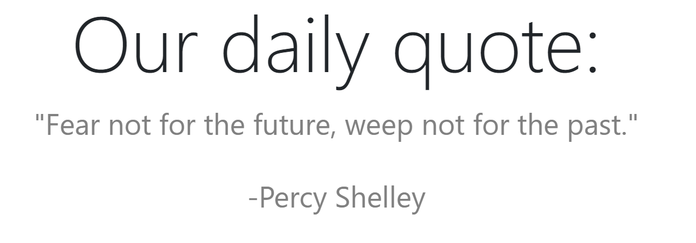
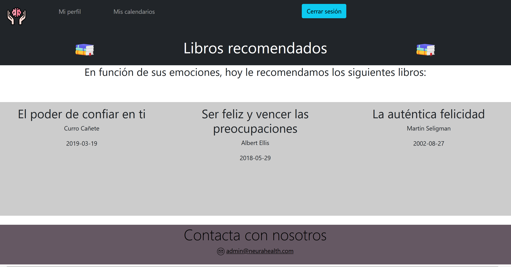

# NeuraHealth
### Práctica Final de PAT
#### Miriam Colino y Claudia Blanco
##### 3ºA GITT

- Se hace uso de una API de frases inspiracionales: https://type.fit/api/quotes. Cada vez que se abra la aplicación aparece una nueva:

- Al usuario se le recomiendan 3 libros sobre alguna emoción que tenga guardada:

