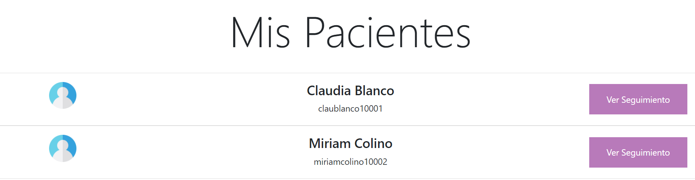

# NeuraHealth
### Práctica Final de PAT
#### Miriam Colino y Claudia Blanco
##### 3ºA GITT

NeuraHealth es una aplicación web cuyo objetivo es permitir al usuario hacer un seguimiento de sus emociones o estados de ánimo.
Se puede utilizar NeuraHealth como usuario o como psicólogo. Los usuarios tienen acceso al seguimiento de emociones, a recomendaciones de libros, etc. y pueden elegir si quieren o no tener un psicólogo asociado.
El psicólogo puede ver el seguimiento de estados de ánimo de sus pacientes/usuarios asociados y, si lo cree conveniente, puede escribirles por correo electrónico para agendar una sesión.

##### PÁGINA INICIAL (index.html)
Esta vista web es la que aparece nada más ejecutar el proyecto. 
- Se utiliza un Carousel de Bootstrap

- Se hace uso de una API de frases inspiracionales: https://type.fit/api/quotes. Cada vez que se abra la aplicación aparece una nueva:

- Desde esta página inicial, se puede iniciar sesión o registrarse

###### Inicio de sesión
Se puede iniciar sesión como usuario de NeuraHealth o como psicólogo (inicio.html).

Se ha implementado una gestión de errores en el inicio de sesión:

###### Registro
Al igual que en el inicio de sesión, los usuarios de la aplicación pueden registrarse como usuarios o como psicólogos (registro.html).

También se ha implementado una gestión de errores de manera que:
- Si el nombre de usuario ya existe, aparece un mensaje de aviso y no se permite hacer el registro
- Si la contraseña tiene una longitud menor de 8 caracteres, se avisa también
- Se valida también el correo electrónico del usuario utilizando una REGEXP en Javascript

Una vez registrado, se redirigirá al usuario/psicólogo a la página de inicio de sesión para que pueda iniciar sesión.

#### FUNCIONALIDADES DE USUARIO
Una vez iniciada la sesión como usuario, se le lleva a la página de inicio de usuario (userIndex.html), desde la que tendrá acceso a través de la barra de navegación a diferentes secciones y funcionalidades explicadas a continuación.

###### Mis Calendarios
El usuario podrá ver sus estados de ánimo guardados del mes que elija, en formato de calendario (usercalendar.html). Si no tiene emociones registradas ese mes, aparecerá un calendario en blanco.

Además, cada día tendrá la opción de añadir su estado de ánimo. Una vez guardado, no podrá cambiarlo. 

###### Mi Perfil
En esta sección (cambiarDataPerfil.html), el usuario puede ver sus datos y hacer cambios: su nombre de usuario, su contraseña, su psicólogo... 

El usuario puede cambiar los datos de su perfil eligiendo el dato que quiere modificar y pulsando en "Cambiar":

Por ejemplo, si decide cambiar el nombre de usuario, aparecerá lo siguiente:

Si elige un nombre de usuario que ya existe, saltará un mensaje de error:

También tiene la opción de ver los psicólogos de NeuraHealth y elegir uno. Para ello es necesario pulsar en el botón "Conoce a otros psicólogos de NeuraHealth":

###### Recomendaciones de Libros
En esta sección (libros.html), al usuario se le recomiendan 3 libros sobre alguna emoción que tenga guardada:

Si no tiene emociones guardadas aparecerá un mensaje como se muestra a continuación:
[...]

###### Cierre de sesión
Para cerrar sesión, basta con pulsar en el botón de cerrar sesión de la barra de navegación. Saltará un mensaje avisando de que el cierre ha sido correcto y se redirigirá a la página inicial.

#### FUNCIONALIDADES DE PSICÓLOGO
Una vez iniciada la sesión como psicólogo, se le lleva a la página de inicio de psicólogo (psicIndex.html), desde la que tendrá acceso a través de la barra de navegación a diferentes secciones y funcionalidades explicadas a continuación.

###### Mis Pacientes
En esta sección (mispacientes.html), el psicólogo puede ver los pacientes que tiene asociados.

Para ver el seguimiento de estados de ánimo de cada uno, pulsará en "Ver Seguimiento":

Podrá ocultar la información de nuevo si lo desea y también enviar un correo electrónico al paciente parra programar una sesión, pulsando el botón "Send".
Al darle a Send, se abrirá la aplicación de correo electrónico para mandarlo.

Si el psicólogo no tiene pacientes asociados aún, en esta sección aparecerá un mensaje para contactar con el departamento de administración de NeuraHealth.

Al darle a Send, se abrirá también la aplicación de correo.

###### Cierre de sesión
Para cerrar sesión, basta con pulsar en el botón de cerrar sesión de la barra de navegación. Saltará un mensaje avisando de que el cierre ha sido correcto y se redirigirá a la página inicial.

###### Footer
Por último, cabe destacar que se ha añadido un Footer a la web desde el cual se permite contactar con la administración de NeuraHealth.
